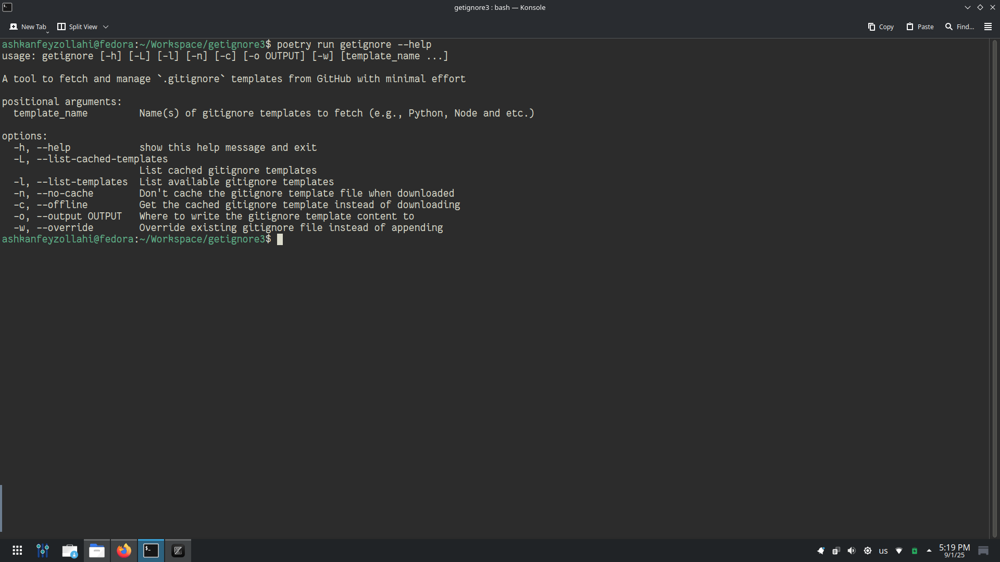

# GetIgnore3



<p align="center"><em>😎 Fetch and manage `.gitignore` templates from GitHub with minimal effort</em>
    <br>
    
    
    
</p>

**getignore** is a simple, no-fuss command-line tool for fetching .gitignore templates from the official GitHub gitignore repository. Whether you're starting a new project or tidying up an old one, getignore lets you easily grab the right .gitignore file for your stack — without digging through websites or typing out boilerplate.

## Installation

1. **[Install Pipx](https://gist.github.com/ashkanfeyzollahi/7bbf36fb876a3781efbbb3ef841b5f4e)** (if you don't have it already)

2. **Install `getignore3` using Pipx**:

```bash
pipx install getignore3
```

## Usage

```
usage: getignore [-h] [-L] [-l] [-n] [-c] [-o OUTPUT] [-w]
                 [template_name ...]

A tool to fetch and manage `.gitignore` templates from GitHub with minimal effort

positional arguments:
  template_name         Name(s) of gitignore templates to fetch
                        (e.g., Python, Node and etc.)

options:
  -h, --help            show this help message and exit
  -L, --list-cached-templates
                        List cached gitignore templates
  -l, --list-templates  List available gitignore templates
  -n, --no-cache        Don't cache the gitignore template file when
                        downloaded
  -c, --offline         Get the cached gitignore template instead of
                        downloading
  -o, --output OUTPUT   Where to write the gitignore template
                        content to
  -w, --override        Override existing gitignore file instead of
                        appending
```
